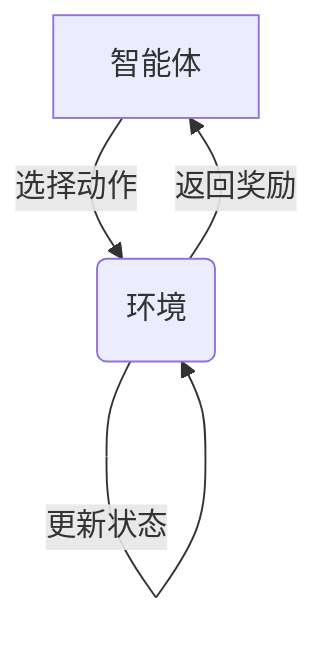

# Q-learning 交互式学习指南

## 1. 核心概念 (先理解理论)


### 关键概念卡片
| 概念 | 解释 | 21点示例 |
|------|------|----------|
| **状态(State)** | 环境的当前情况 | (玩家点数, 庄家明牌, 是否有A) |
| **动作(Action)** | 智能体的选择 | 停牌(0) 或 要牌(1) |
| **奖励(Reward)** | 动作的即时反馈 | 赢: +1, 输: -1, 平: 0 |
| **Q值** | 状态-动作对的长期价值 | 存储在Q表中 |

## 2. Q-learning 算法分步解析

### 步骤1: 初始化Q表
```python
# 使用defaultdict初始化Q表
self.q_values = defaultdict(lambda: np.zeros(action_space_n))
```

### 步骤2: 选择动作 (ε-贪婪策略)
```python
if np.random.random() < self.epsilon:  # 探索
    return env.action_space.sample()
else:  # 利用
    return int(np.argmax(self.q_values[obs]))
```

### 步骤3: 更新Q值 (时间差分学习)
```python
# 计算未来价值
future_q = (not terminated) * np.max(self.q_values[next_obs])

# 计算TD误差
td_error = reward + self.discount_factor * future_q - self.q_values[obs][action]

# 更新Q值
self.q_values[obs][action] += self.lr * td_error
```

## 3. 动手实验区

### 实验1: 调整探索率
```python
# 修改初始ε值，观察学习曲线变化
start_epsilon = 0.5  # 原值1.0
```

**思考题**：ε值过高会导致什么结果？过低呢？

### 实验2: 修改奖励函数
```python
# 在env.step()后修改奖励
if reward == 1:  # 获胜
    reward = 2   # 加倍奖励
```

**任务**：运行代码并观察奖励曲线的变化

## 4. 学习路径检查表

1. [ ] 理解状态、动作、奖励的基本概念
2. [ ] 在代码中找到Q表初始化的位置
3. [ ] 修改ε值并观察探索行为变化
4. [ ] 定位Q值更新函数
5. [ ] 添加print语句输出关键决策点:
```python
print(f"状态: {obs}, 选择动作: {'停牌' if action == 0 else '要牌'}, Q值差异: {self.q_values[obs][0]-self.q_values[obs][1]:.2f}")
```

## 5. 常见问题解答

### Q: 为什么需要折扣因子γ?
A: γ(0.95)平衡即时奖励和长期收益，值越大表示越重视未来奖励

### Q: 训练曲线波动大怎么办?
A: 尝试：
1. 减小学习率α(0.01→0.001)
2. 增加训练回合数(100,000→500,000)
3. 调整ε衰减速度

### Q: 如何知道智能体学到了什么?
A: 在演示阶段添加策略分析：
```python
print(f"状态{obs}的最佳动作: {'停牌' if np.argmax(agent.q_values[obs]) == 0 else '要牌'}")
```

## 6. 延伸挑战

1. 添加新状态：记录连续要牌次数
2. 实现双Q学习减少过估计
3. 将Q表替换为神经网络(DQN)